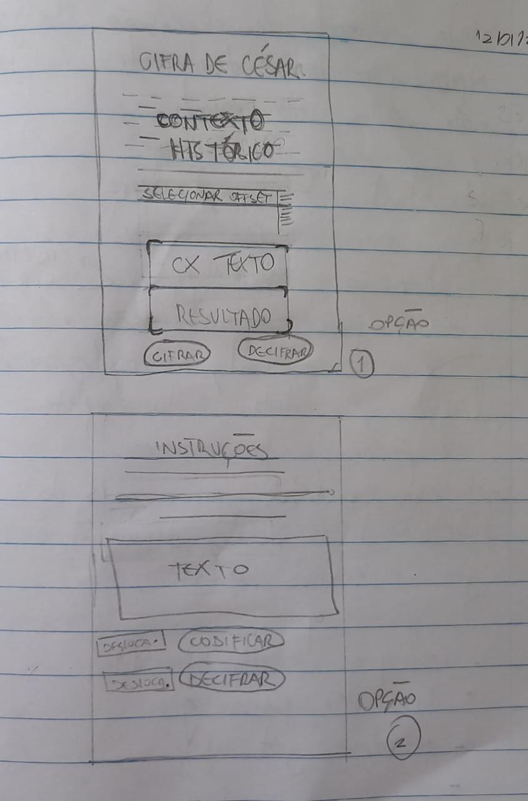

# Cifra de César

## Índice

- [1. O que é Cifra de César](#1-cifra-de-cesar)
- [2. Resumo do projeto](#2-resumo-do-projeto)
- [3. Público Alvo](#3-publico-alvo)
- [4. Esboço da aplicação](#4-esboço-da-aplicação) 

---

## 1. O que é Cifra de César

A cifra de César é uma das técnicas mais simples de cifrar uma mensagem, recebe esse nome pois foi utilizada por Júlio César para se comunicar com seus generais, protegendo mensagens militares. É um
tipo de cifra por substituição, em que cada letra do texto original é
substituida por outra que se encontra há um número fixo de posições
(deslocamento) mais a frente do mesmo alfabeto.

Atualmente todas as cifras de substituição alfabética simples, são decifradas
com facilidade e não oferecem muita segurança na comunicação por si mesma,
mas a cifra de César muitas vezes pode fazer parte de um sistema
mais complexo de criptografia, como
a cifra de Vigenère, e tem aplicação no sistema ROT13.

## 2. Resumo do projeto

Com base nos princípios da Cifra de César, esta página Web permite que o usário cifre ou decifre uma mensagem de texto. Para isso, será necessário escolher uma chave de deslocamento.

## 3. Público Alvo

Esta página web é destinada a qualquer pessoa que tenha curiosidade em cifrar ou decifrar uma mensagem de texto, utilizando a Cifra de César como método.

## 4. Esboço da aplicação #-esboço-da-aplicação 
 

